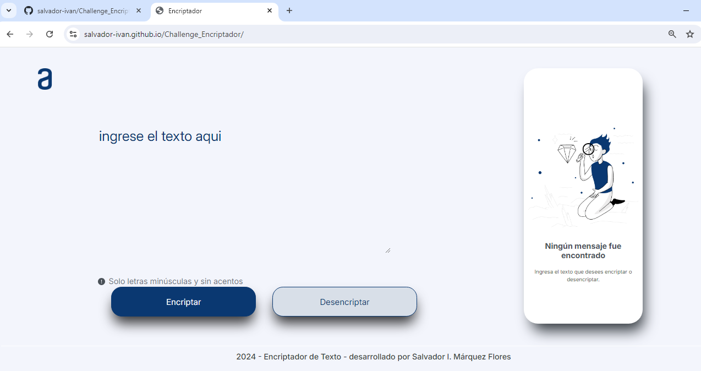
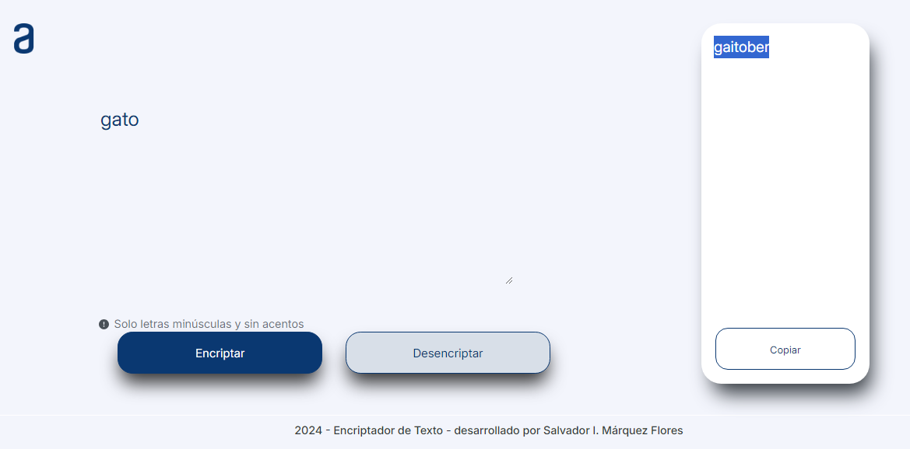

# Challenge-Encriptador de Texto
Desafío de lógica de programación del programa **ONE-AluraLatam**.
> Aplicación para encriptar y desencriptar un texto.
El proyecto "deployado" se puede visualizar en https://salvador-ivan.github.io/Challenge_Encriptador/

